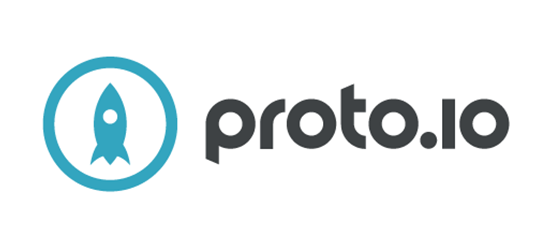
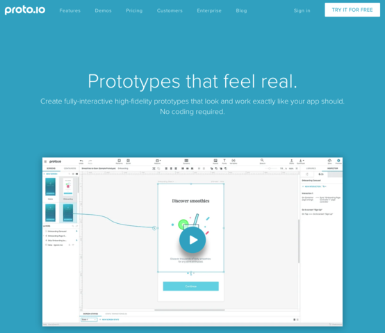
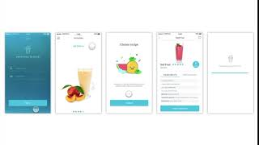
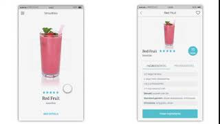
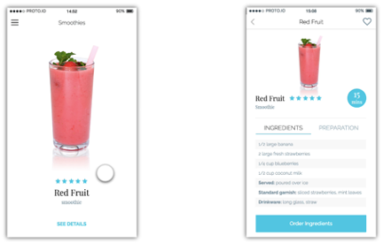
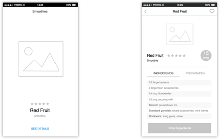

[Zurück](https://github.com/milena-sagert/IFD-WiSe20-21) | [Teamseite](https://webuser.hs-furtwangen.de/~rag/lehre/WiSe20-21/IFD/Kursinhalt/Team/)
# #02 - Prototyping Tool
## 2.1 Vorstellung von *Proto.io*

### 1. Allgemeine Beschreibung:

Das Prototyping Tool Proto.io ist eine von PROTOIO Inc. entwickelte und 2011 gestartete Plattform, welche in einer vielseitigen webbasierten Umgebung die Erstellung von interaktiven Prototypen ermöglicht und dabei keinerlei Codierung erfordert.

Seit seiner Einführung wurden sechs Versionen von Proto.io veröffentlicht. Laut eigenen Angaben wird das Tool von über 500.000 Menschen genutzt. Für den Anfang ist eine kostenlose 15-Tage Testversion mit vollem Funktionsumfang verfügbar, darüber hinaus stellt der Anbieter fünf weitere verschiedene Abonnements für unterschiedliche Nutzergruppen bereit. 

### 1.1 Kernfeatures:

Eine der Haupteigenschaften von Proto.io ist die intuitive Benutzeroberfläche, die mit einem Drag-and-Drop-System ausgestattet ist, das ohne Codierung genutzt werden kann. 

Das Werkzeug zeichnet sich aus durch seine endlosen Kombinationen: Es stehen gebrauchsfertige Vorlagen zur Verfügung, die eine Vielzahl vollständig angepasster Blöcke und Elemente, einschließlich aller gängigen Optionen bietet, wodurch Workflows zur Visualisierung von Ideen erheblich beschleunigt werden können. Zudem verfügt das Tool über Designkonsistenz: Vorlagenelemente wurden so konzipiert, dass sie in beliebiger Kombination zusammenarbeiten und UX-fähig sind.

Das Tool bietet jede Funktion, die man jemals benötigen könnte, um den ultimativen Prototyp zu erstellen.

&nbsp;

&nbsp;

### 2. Fidelity: 

#### Interaktivität:

Mit Proto.io erstellte Projekte, heben sich deutlich von primitiven, nicht klickbare Prototypen ab. Objekte können extrem realitätsnah umgesetzt werden. Statt auf statische Elemente setzt Proto.io auf Dynamik. Mit auslösbaren Aktionen (Bildschirm wechseln, Scrollen, Animationen, Audio, Video, GIFs, E-Mails, URLs öffnen, Anrufe tätigen u.v.m.)
sowie (Multi-) Touch Events (tap, double tap, hold, drag, swipe, pinch, zoom u.v.m.) und Mouse- oder Keyboard Events (Klicken, Mouseover, Rechtsklick u.v.m.) wird ein hoher Grad an Interaktivität geschaffen. Abgerundet wird dies außerdem durch interaktive UI-Elemente der Benutzeroberfläche, diese reichen von Schaltflächen bis hin zu Kippschaltern, Listen, Registerkartenleisten und spezielle Komponenten wie Eingabefelder.

&nbsp;

#### Visualisierung:

Mit Proto.io ist der Grad visueller Fidelity frei wählbar. Zunächst können z.B. Wireframes erstellt und anschließend Bilder, Schriften und Designs hinzugefügt werden. Mit der Drag & Drop Oberfläche lassen sich aus der 
UI-Komponentenbibliothek zahlreiche, in der Größe und Farbe vollständig anpassbare, Elemente aus verschiedenen Betriebssystemen wie iOS, Material Design, Windows o.ä. wie Schaltflächen, Menüs, Eingaben, Schiebereglern etc. verwenden.
Dazu kommt eine umfangreiche Icon Bibliothek, (animierte) Symbole, eine Soundeffekt-Bibliothek, Audio- und Videokomponenten, die u.A. eine Verknüpfung mit Drittanbietern wie YouTube oder Vimeo ermöglichen, Lottie-Animation, die mit Hilfe eines Bodymovin-Plugin die Integration von After Effects-Animationen bewerkstelligt, Bildlaufbehälter, mit denen scrollbare Bereiche und Karussells erstellt werden können. 
Sowie Webview- und HTML-Code-Komponenten, über welche benutzerdefinierte externe HTML-Seiten oder Codekomponenten hinzugefügt werden können.

&nbsp;

<!--- VIDEO--->

<!---

--->

#### Inhaltsentwicklung

&nbsp;

---
[Nach oben &#x25B2;](#top)