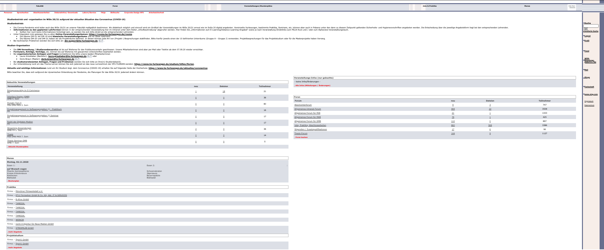

[Zurück](https://github.com/milena-sagert/IFD-WiSe20-21) | [Teamseite](https://webuser.hs-furtwangen.de/~rag/lehre/WiSe20-21/IFD/Kursinhalt/Team/)
# #02 - Prototyping 
## 2.2 Konzeptentwurf vom *DM-Intranet*

&nbsp;

### 1. Idee:
Grundsätzlich muss das DM-Intranet intuitiver gestaltet werden. Die Plattform muss auf die wesentlichen Inhalte komprimierrt werden. Dazu ist die Reduzierung der Unterseiten sowie eine neue Anordnung der 
relevanten Elemente notwendig. 

&nbsp;

Konkret sollen die Inhalte größer und übersichtlicher dargestellt werden. 
Die Menüs werden auf einen zentralen Header und einen Footer beschränkt, womit die Sitebar überflüssig wird. 
Zudem wird der Kern des DM-Inranetes personalisiert und mit diversen externen Tools zur Selbstorganisation und Informationsbeschaffung verknüpft.

&nbsp;

### 2. Startseite/Dashboard:

#### 1
Grundsätzlich

#### 2
#### 3
#### 4
#### 5
#### 6
#### 7
#### 8
#### 9

## 2. Kursseite:

#### 10
#### 11
#### 12

---
[Nach oben &#x25B2;](#top)
