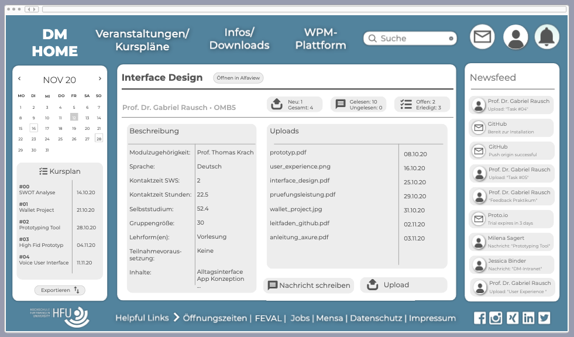

[Zurück](https://github.com/milena-sagert/IFD-WiSe20-21) | [Teamseite](https://webuser.hs-furtwangen.de/~rag/lehre/WiSe20-21/IFD/Kursinhalt/Team/)
# #03 - Wahrnehmung & Aufmerksamkeit 
## 3.1 High-Fid Prototype vom *DM-Intranet*

&nbsp;

### X
x

---
[Nach oben &#x25B2;](#top)
