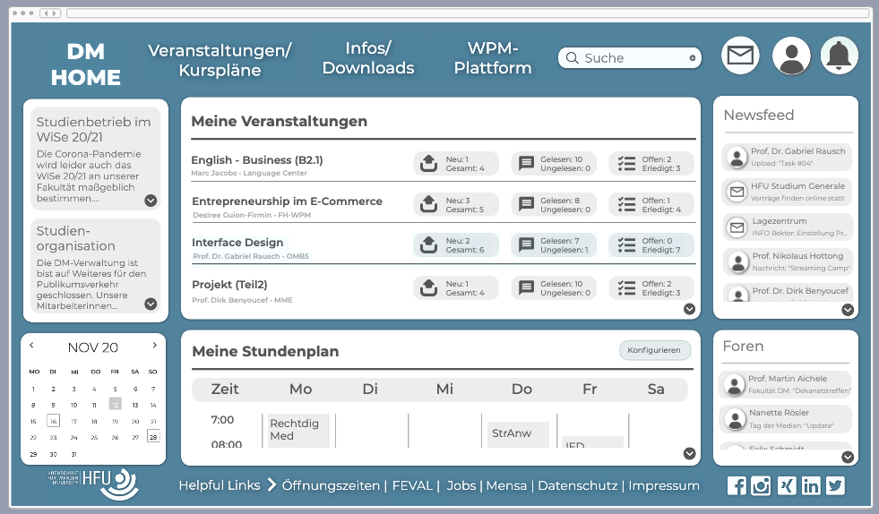
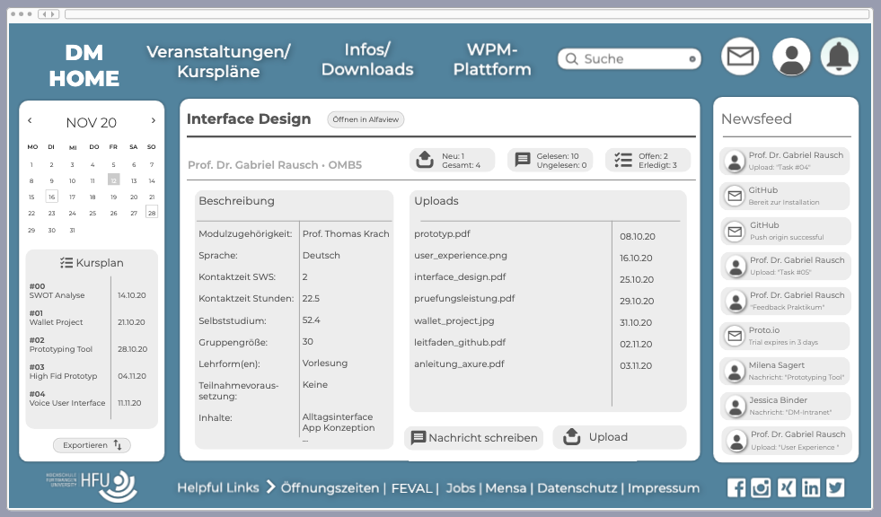

[Zurück](https://github.com/milena-sagert/IFD-WiSe20-21) | [Teamseite](https://webuser.hs-furtwangen.de/~rag/lehre/WiSe20-21/IFD/Kursinhalt/Team/)
# #03 - Wahrnehmung & Aufmerksamkeit 
## 3.1 High-Fid Prototype vom *DM-Intranet*

&nbsp;

### Zum Screencast des Prototypes: [Vorschau]() 

<a href="https://github.com/milena-sagert/IFD-WiSe20-21/blob/main/index.html" target="_blank">#03 - Prototyp</a>  

<a href="./index.html" target="_blank">#03 - Prototyp</a>  

<a href="03-GUI/index.html" target="_blank">#01 - Wallet Project</a>  

#### Zur Browser-Anwendung des Prototypes: [Vorschau](https://pr.to/LSR7DH/) (pausiert)
---

&nbsp;

###### Screenshot - Startseite (IFD)
---

&nbsp;

###### Screenshot - Kursseite (IFD)
---

&nbsp;

&nbsp;

[Nach oben &#x25B2;](#top)
