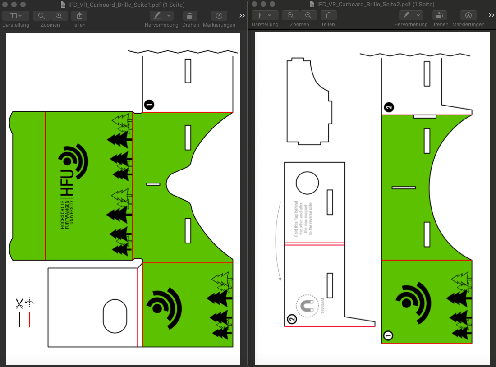

[Zurück](https://github.com/milena-sagert/IFD-WiSe20-21) | [Teamseite](https://webuser.hs-furtwangen.de/~rag/lehre/WiSe20-21/IFD/Kursinhalt/Team/)
# #06 - VR Cardboard Brille

&nbsp;

### 1. Erstellung des Designs:
Für die Papiervorlage wurde ein HFU-Design erstellt. Auf Basis des Corporate Designs der Hochschule Furtwangen wurde bei der Farbwahl die Primärfarbe "frisches Apfelgrün" berücksichtigt. Das Logo ist wurde sowohl auf der Vorderseite der VR Brille, als auch auf der rechten und linken Seite platziert. 
Ergänzt wird das Ganze durch tannenförmige Vektorgrafiken, die den Schwarzwald und somit den Standort der Hochschule symbolisieren sollen.

&nbsp;

### 2. Startseite/Dashboard:

#### 1 DM-Home
Ein zentraler Home Button, der in der linken oberen Ecke der Seite positioniert ist und mit dem man von jeder Unterseite wieder zur Startseite/Dashboard zurück gelangt.

#### 2 Header Menü
Wichtige Punkte wie Veranstaltungen/Stundenpläne, Infos/Downloads sowie die WPM-Plattform sind immer erreichbar im Header zu finden. Außerdem eine Suchfunktion sowie drei Schnellzugriffe für Mails, Profil und Benachrichtigungen.
Diese werden als schnell identifizierbare Icons dargestellt. Über das Mail Symbol erfolgt eine Weiterleitung zum Webmail Service der Hochschule "SOgo Web Interface". Mit dem Personen Symbol gelangt man zu seinem persönlichen Profil und erhält gleichzeitig einen Überblick über weitere Personen.

#### 3 News & Infos
Alle aktuellen Neuigkeiten sowie Hinweise zu Studienbetrieb und -organisation im jeweiligen Semester sind hier zu finden. 

#### 4 Kalender & Termine
Die wichtigsten Termine und Events der Hochschule und insbesondere der Fakultät "Digitale Medien" werden im Kalender angezeigt. Dieser hat zudem eine Erinnerungs Funktion, mit welcher man sich zu bestimmten Ereignissen explizit benachrichtigen lassen kann.

#### 5 Gebuchte Module
Alle gebuchten Veranstaltungen sind übersichtlich zusammengefasst. Zu den jeweiligen Modulen sieht man direkt eine kurze Info zu aktuellen News, Uploads und der Teilnehmeranzahl.

#### 6 Mein Stundenplan
Statt dem externen browserbasierten Stundenplan Konfigurator steht nun ein neuartiges, lokal im Intranet verfügbares, Stundenplan Tool zur Verfügung, welches Überblick über Uhrzeit und Block, Veranstaltungsraum sowie Professor/Dozent vermittelt.

#### 7 Meldungen
Aktuelle Meldungen wie neue Uploads, veränderte Dateien, eingegangene Mails oder neue Foren Einträge werden in einem zeitlich geordneten Liste geupdatet. Die Symbole geben schnell Auskunft über die Art der Benachrichtigung.

#### 8 Foren
Foren zu unterschiedlichen Themem wie Abschlussarbeiten oder für verschiedene Studiengänge kann man sich ebenfalls für die eigenen Vorliebe einrichten und auf der Startseite angezeigt bekommen.

#### 9 Footer
Im Footer der Startseite finden man allgemeine Informationen und hilfreiche Link zu Themen wie Öffnungszeiten und Sprechzeiten, FEVAl, Jobs, der Mensa oder zum Datenschutz und Imoressum. Außerdem gelangt man über das HFU Logo direkt auf die offizielle Website der Hochschule. 
Zudem sind alle Social Media Accounts Hochschule bzw. der Fakultät verlinkt. 

&nbsp;

## 2. Kursseite:

#### 10 Sidebar
Neben einem mit der Startseite identischen Header und Footer besitzt die Kursseite eine eigene Sitebar. 
Über deren Unterpunkte gelangt man zu verschiedenen Unterseiten wie einer Kursbeschreibung, für den Kurs relevante Termine und Abgaben, den Teilnehmer Infos, dem Mail Verteiler sowie zu einem seperaten Forum, in welchen sich lediglich eingeschriebene Kursmitglieder und Professor/Dozent untereinander austauschen können.

#### 11 Modulbeschreibung
Im oberen Bereich der Seite sind der Name des Kurses, die Kontaktdaten des lehrenden Professors/Dozenten sowie die Verlinkung zu dem Online Raum in alfaview vermerkt.

#### 12 Inhalt
Der Hauptteil der Kursseite besteht aus zwei Übersichtsfeldern: Einem Bereich für Nachrichten und Ankündigen von der Seite des Lehrenden und einen Bereich für Datei Uploads wie Materialen und Vorlesungsfolien etc. Zusätzlich zu den Dateinamen und dem Thema werden Änderungsdaten und Aktivitäten aufgelistet. Auch Studierende haben die Möglichkeit Inhalte hochzuladen.

&nbsp;

---
[Nach oben &#x25B2;](#top)

### Zum Screencast: 
[Öffnen](https://www.youtube.com/watch?v=OJUvaAYF4kg&feature=youtu.be) 

### Zur Anwendung: 
[Öffnen](https://adobe.ly/36BVWzF)

&nbsp;

---
[Nach oben &#x25B2;](#top)