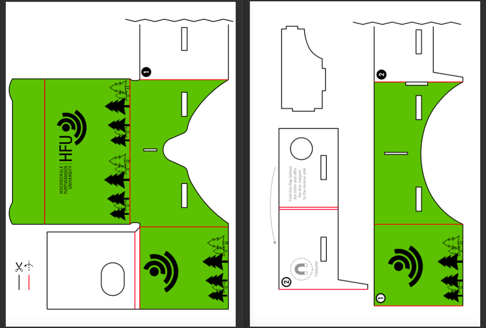
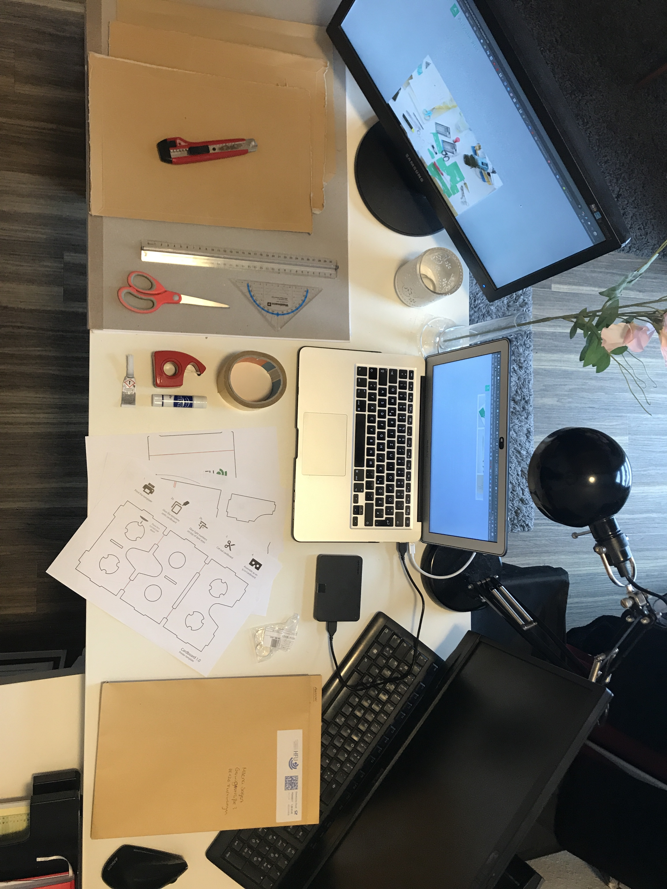
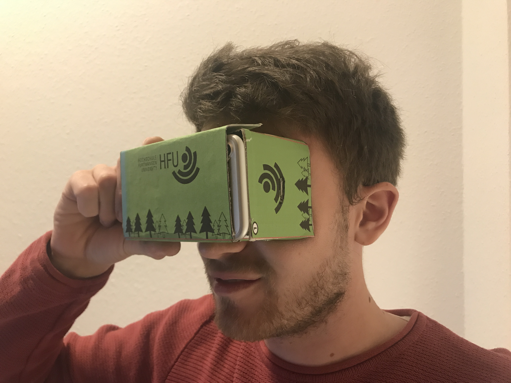

[Zurück](https://github.com/milena-sagert/IFD-WiSe20-21) | [Teamseite](https://webuser.hs-furtwangen.de/~rag/lehre/WiSe20-21/IFD/Kursinhalt/Team/)
# #06 - VR Cardboard Brille

&nbsp;

## 1. Erstellung des Designs:

Zur visuellen Optimierung der Brille wurde ein HFU-Design für die Papiervorlage erstellt. Auf Basis des Corporate Designs der Hochschule Furtwangen wurde bei der Farbwahl die Primärfarbe "frisches Apfelgrün" berücksichtigt. Das Logo ist wurde sowohl auf der Vorderseite der VR Brille, als auch auf der rechten und linken Seite platziert. 
Ergänzt wird das Ganze durch tannenförmige Vektorgrafiken, die den Schwarzwald und somit den Standort der Hochschule symbolisieren.

&nbsp;

## 2. Dokumentation des Zusammenbaus:
(Schritt-für-Schritt Dokumentation)

### 1. Materialien:

- Pappe
- Schere (groß + klein)
- Lineal 
- Klebestift
- Doppelseitiges Klebeband
- Cutter Messer
- Skalpell
- Ausdruck der Papiervorlage

### 2. Zusammensetzung:

#### Zur Veranschaulichung des Fertigungs Prozesses dient die Aufnahme eines Zeitraffer Videos: [Öffnen](https://youtu.be/9VIoaTH1ais) 
---
#### Folgende Schritte waren Bestandteil der Durchführung:
1. Ausschneiden der Papiervorlage
2. Zeichnen der Umrisse auf Pappe
3. Ausschneiden der Pappteile
4. Aufkleben der Papiervorlage auf Pappe
5. Knicken der Pappe
6. Einsetzen der Linsen
7. Zusammenstecken der Teile

&nbsp;

## 3. Endergebnis:

&nbsp;

---
[Nach oben &#x25B2;](#top)