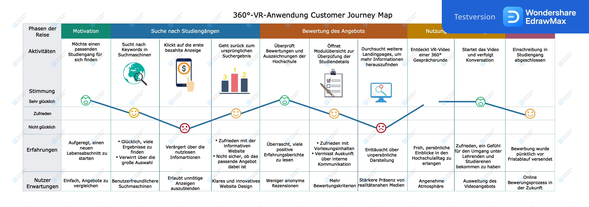
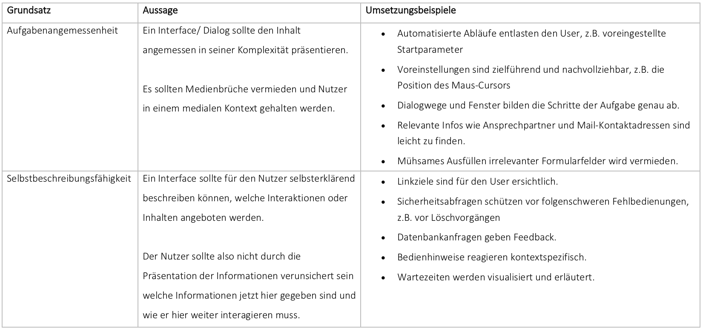
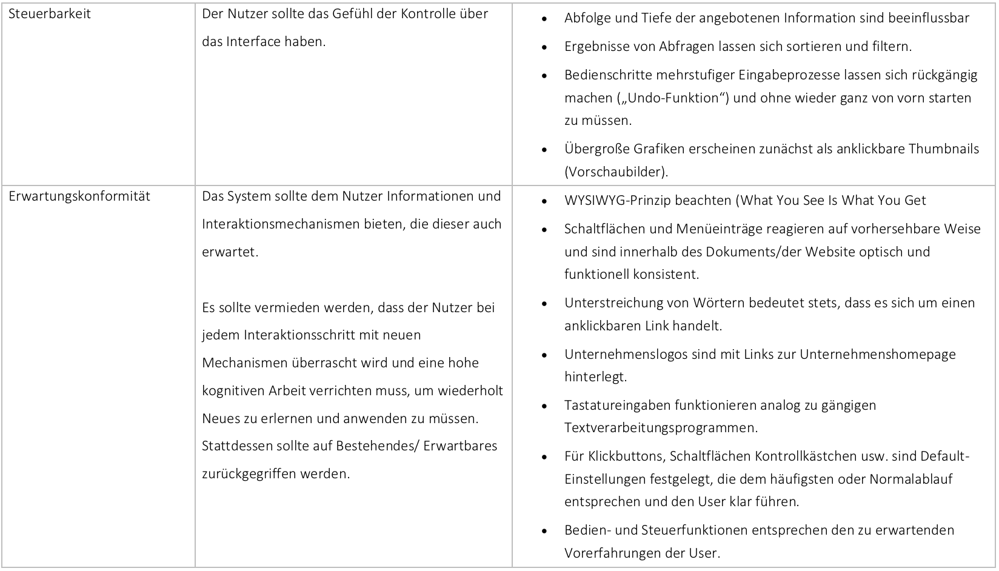
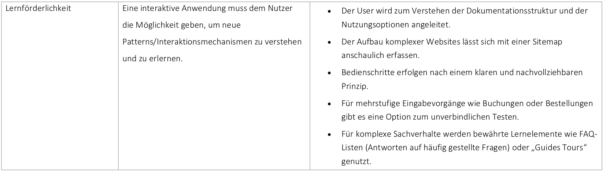
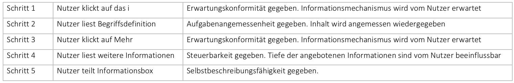
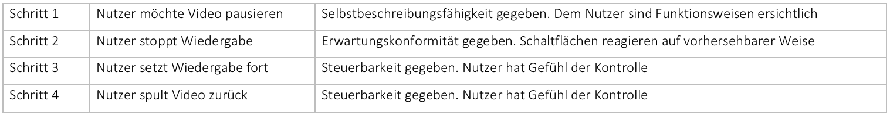
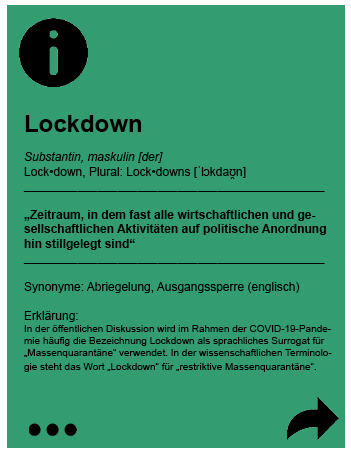

[Zurück](https://github.com/milena-sagert/IFD-WiSe20-21) | [Teamseite](https://webuser.hs-furtwangen.de/~rag/lehre/WiSe20-21/IFD/Kursinhalt/Team/)
# Interface Design WiSe20/21 - Prüfungsaufgabe (Klausur-Ersatz)

### Evaluierung & Verbesserung eines Prototypen aus diesem Semester

Für die Prüfungsaufgabe und als Klausur-Ersatz der Veranstaltung Interface Design im Wintersemester 2020/21 wurde ein VR-Prototyp aus dem Praktikumsblock des Kurses unter Berücksichtigung der Customer Journey Map, der Heuristischen Evaluation sowie der Prototyp Enhancement verprobt und weiterentwickelt. 

&nbsp;

## 1. Auswahl des Prototypen  

Zur Bearbeitung der Aufgabenstellung wurde ein Prototyp aus den Aufgabenblöcken zu GUI, VUI oder VR ausgewählt. Hierbei fiel die Entscheidung auf die VR-Anwendung. Der aktuelle Stand dieses Prototypen bildete die Basis der Weiterentwicklung. 

**Prototyp:** 360° Gesprächsrunde als VR-Anwendung  
[Video öffnen](https://youtu.be/d1KyXhO6h9Q)  
*(Stand: 20.01.2021)*

&nbsp;

## 2. Customer Journey Map

(Potentielle) Nutzer durchlaufen mehrere Stationen vom Beginn Ihrer Suche bis hin zur Conversion. Das bekannte AIDA Modell beschreibt die Stationen von der Attention, über den Interest zu Desire bis hin zur gewünschten Action. Customer Journeys – und deren Mapping – sind die logische Weiterentwicklung dieses im Marketing bewährten Modells und

Um Ideen für die Optimierungen des VR-Prototypes zu erhalten und zu untersuchen wie die VR-Anwendung genutzt werden würde, wie Nutzer/Kunde mit diesem Produkt in Kontakt kommen auch damit interagieren würden und um die Touchpoints zwischen dem Produkt (Prototypen) und dem Nutzer zu visualisieren, wurde eine Customer Journey Map erstellt.

Diese bietet einen umfassenden Überblick über aktuelle Organisationspraktiken, da sie grundsätzlich die User Experience-Geschichte des Nutzers erzählt und über die einzelnen Touch-Points hinweg seine Gefühle, Verhaltensweisen, Bedenken und Motivationen zeigt.

&nbsp;

### 2.1. Nutzung

360° Videos werde heute in vielen Unternehmensbereichen eingesetzt. Der Hauptvorteil dabei ist: Mit dem Filmformat werden Produktwelten, Einblicke ins Unternehmen und Trainings zu einem emotionalen Erlebnis. Dabei ist das Gefühl, nicht nur zuzusehen, sondern ein Teil des Geschehens zu sein ein essentieller Vorteil der Technologie.

Genau wie in klassischen Filmformaten können auch in 360° Videos Luftaufnahmen, Kamerafahrten und Stativaufnahmen realisiert werden. Auch 3D-Animationen sind möglich. Damit können Zuschauer nicht nur in bekannte Szenarien versetzt werden, sondern auch in völlig neue Welten eintauchen.

360° Videos können sowohl auf einer VR-Brille als auch auf Websites und Social-Media-Kanälen verwendet werden. Im Einsatz auf Messen können die Filme dann einzeln oder Gruppen von bis zu 100 Personen gleichzeitig gezeigt werden.

&nbsp;

### 2.2. Interaktion

Der im Kurs verwendete web-basierte stereoskopische VR-Prototyp einer Gesprächsrunde zwischen Professoren und Studierenden der Hochschule Furtwangen bietet zum Beispiel für Studieninteressierte einen realitätsnahen Einblick in die Kommunikation zwischen Akteuren der Institution. Mit einem 360° Rundumblick wird der Nutzer in eine andere Situation versetzt. Erleben, statt nur zu sehen – dies macht den entscheidenden Unterschied und lässt Eindrücke länger im Kopf behalten. 

Eine beispielhafte Anwendung könnte folgendes Szenario sein: 

*Die Abiturientin Anna ist auf der Suche nach einem geeigneten Studiengang für ihre berufliche Karriere. Sie recherchiert im Web nach Studienangeboten und vergleicht verschiedene Hochschulen miteinander. Unter anderem stößt sie bei ihrer Suche auf die Website der HFU. Der Studiengang Medienkonzeption spricht sie besonders an. Wichtig sind ihr bei ihrer Auswahl fachliche Schwerpunkte, die technische Ausstattung sowie das zwischenmenschliche Verhältnis und die Kommunikation unter Lehrenden und Studierenden. Während Anna zwischen Modulplänen und Einrichtungen umherscrollt, richtet sich ihre Aufmerksamkeit auf ein 360° Video. Zu sehen ist eine Gesprächsrunde zwischen zwei Professoren der Fakultät Digitale Medien und einer Studierenden des Studiengangs Medienkonzeption. „Interessant, das schaue ich mir an!“ denkt sie sich und startet das Video. Auf sympathische Art und Weise diskutieren die drei Teilnehmer der Gesprächsrunde über aktuelle relevante Themen. Während Meinungen geteilt und Informationen ausgetauscht werden herrscht eine angenehme und vertraute Atmosphäre. Mit authentischem Charakter bildet der Clip den internen Umgang an der Hochschule ab – Anna ist begeistert.
Ein paar Tage später schickt sie ihre Bewerbungsunterlagen in den Schwarzwald. Das 360° Video hat sie überzeugt: Sie möchte die kommenden Jahre an der HFU studieren.*

&nbsp;

### 2.3. Visualiserung der Touchpoints

Jede Interaktion und jeder Kontakt eines Nutzers mit einer Anwendung wird als Touchpoint bezeichnet – unabhängig davon, ob der Kontakt vor, während oder nach der Interaktion stattfindet.

Ziel beim Visualisieren mittels einer Customer Journey Map ist es, alle relevanten Touchpoints zu berücksichtigen. Jeder Touchpoint verfolgt ein bestimmtes Ziel und muss daher aus Kundensicht definiert werden. 

Im Rahmen dieses Bearbeitungsschrittes existieren zu diesem Zeitpunkt keine empirischen Nutzerdaten, um eine belastbare Customer Journey Map zu entwickeln. Die resultierte Darstellung ist folglich aus eigener „Experten-Sicht“ konstruiert wurden.

[Download als EDDX](https://github.com/milena-sagert/IFD-WiSe20-21/blob/main/Pr%C3%BCfungsaufgabe/img/ifd-vr-customer-journey-map.eddx) 

*Anmerkung: Die Abbildung der CJM wurde mit der kostenlosen Version der technischen 2D-Business-Diagrammsoftware "Edraw Max" erstellt.*

&nbsp;

## 3. Heuristische Evaluation

Um Aspekte zu identifizieren, die verbessert werden sollen, wird der Prototypen nun einer formal-analytischen, heuristischen Evaluation unterzogen.

Bei der heuristischen Evaluation handelt es sich um eine Methode, die Gebrauchstauglichkeit einer Benutzeroberfläche formativ zu beurteilen.

Dazu wurde zunächst ein Regelwerk auf Basis der ISO 9241-110 entwickelt und mit Grundsätzen aus dem WCAG 2 angereichert. 

Für die Überprüfung und Bewertung wurden zwei mögliche Aufgaben für den Prototypen entwickelt und in logische Interaktionsschritte unterteilt. 

&nbsp;

### 3.1. Regelwerk

Die europäische Normenreihe EN ISO 9241 legt Kriterien für das Design ergonomischer Benutzerschnittstellen fest. Die Normenreihe EN ISO 9241 wurde in den 1990er Jahren entwickelt. Der Normenteil ISO 9241-110 „Grundsätze der Dialoggestaltung“ stammt aus dem Jahr 2006.

Das folgende Regelwerk stellt eine Basis dar, wie die Grundsätze der Dialoggestaltung gemäß ISO 9241-110 in der Praxis umgesetzt werden können.

[Regelwerk als PDF öffnen](https://github.com/milena-sagert/IFD-WiSe20-21/blob/main/Pr%C3%BCfungsaufgabe/img/Regelwerk.pdf) 

Sicherlich geht die Ergonomie der Mensch Maschinen Interaktion noch über diese sieben Anforderungen hinaus. Doch wenn die Grundsätze der ISO 9241-110 berücksichtigt werden, ist ein hohes Maß an Nutzerfreundlichkeit gewährleistet.

&nbsp;

### 3.2. Aufgaben & Interaktionsschritte

**1. Nutzung der Informationbox**

Mit Hilfe der Informationstafel hat der Nutzer die Möglichkeit sich bei Fachbegriffen über die Bedeutung und den grammatikalischen Aufbau des Wortes zu informieren. Grafisch abgebildet ist zum einen die Begriffserklärung, sowie ein Sharing Button und die Option mehr zu erfahren. 

**2. Bedienung der Steuerungselemente**

Der Nutzer hat die Möglichkeit das 360° Video mithilfe verschiedener Steuerungselementen zu kontrollieren. Über eine Leiste mit integriertem Play- Pause- und verschiedener Spul Button ist es ihm möglich die Anwendung nach Belieben anzuhalten oder abzuspielen. 

&nbsp;

## 4. Protoyp Enhancement

Relevante Inhalte aus der Evaluation wurden nun in dem Protypen verbessert. Dabei wurde sich auf Aspekte fokusiert, die technisch und wirtschaftlich sowie im Rahmen der Zeit und Ressourcen machbar sind. 

&nbsp;

### 4.1. Dokumentation der Weiterentwicklung

Da im aktuellen VR Prototypen (#08 - Mixed Reality Umsetzung) lediglich ein einziges Element umgesetzt wurde, wurde sich bei der Verbesserung auf den vorhergegangenen Aufgabenblock (#07 - Video Prototyp Konzeption) bezogen. Konkret wurden die Informationsbox und die Steuerelemente verbessert. Dazu gehörte die visuelle Anpassung an Farbe (Corporate Design der HFU) sowie eine generelle grafische Überarbeitung.

Aufgrund der gewählten Herangehensweise mit Adobe Premiere die VR-Anwendung prototypisch als YouTube 360° Video abzubilden, war die kreative Umsetzung leider auch sehr eingeschränkt. So konnten keinerlei „reale“ Interaktionsmöglichkeiten geschaffen werden. 

Die folgenden Elemente wurden optimiert:

&nbsp;

---

Verbesserter Prototy:
### Video: [Öffnen](https://youtu.be/5c0WIvNAokg) 

&nbsp;

---
[Nach oben &#x25B2;](#top)